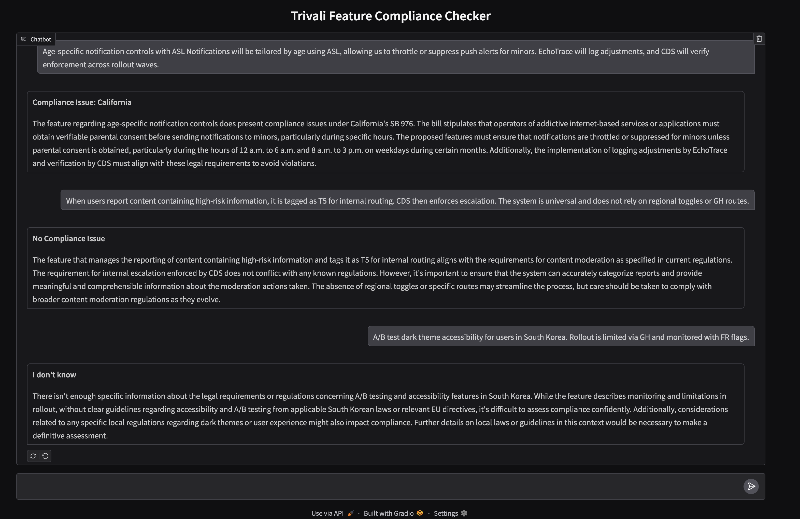

# 🛡️ Trivali Feature Compliance Checker

An AI-powered assistant that flags product features for geo-specific regulatory risks using **Retrieval-Augmented Generation (RAG)**.  
It streamlines compliance checks by combining a policy knowledge base with a terminology glossary, ensuring teams ship features faster without legal surprises.


## 🚀 Features
- 🔍 **Compliance Analysis**: Flags potential violations and geo-specific risks.  
- 📖 **Terminology Lookup**: Expands acronyms and internal jargon into plain English.  
- 🧾 **Grounded Reasoning**: Provides explanations backed by retrieved policies.  
- 💬 **Chat Interface**: Simple UI built with Gradio for interactive use.  


## 🛠️ Tech Stack
- **Python 3.10+**
- **LangChain** — agent orchestration & tools  
- **Chroma** — vector store for policies & terminology  
- **Azure OpenAI API** — LLM for reasoning  
- **Gradio** — web-based chat interface  


## ⚙️ Setup

### 1. Clone the repository
```bash
git clone https://github.com/yourusername/trivali-compliance-checker.git
cd trivali-compliance-checker
```
### 2. Configure environment variables
Create a `.env` file in the root directory with the following format:
```bash
LANGSMITH_API_KEY=your_api_key_here
AZURE_OPENAI_API_KEY=your_api_key_here

AZURE_OPENAI_EMBEDDINGS_ENDPOINT=your_embeddings_endpoint_here
AZURE_OPENAI_EMBEDDINGS_DEPLOYMENT_NAME=your_embeddings_deployment_name_here
AZURE_OPENAI_EMBEDDINGS_API_VERSION=your_embeddings_api_version_here

AZURE_OPENAI_CHAT_ENDPOINT=your_chat_endpoint_here
AZURE_OPENAI_CHAT_DEPLOYMENT_NAME=your_chat_deployment_name_here
AZURE_OPENAI_CHAT_API_VERSION=your_chat_api_version_here
```

### 3. Install the necessary packages
Uncomment the first cell in `TechJam.ipynb` and run it to `pip install` the necessary packages. You may comment it after.

### 4. Load the policy and terminology vector store
Run all cells in `policy_vector_store.ipynb` and `terminology_vector_store.ipynb` to load the respective vector stores with the necessary data. You only need to run this once to load the data.

**Updating the policy vector store** <br>
You can update the policy vector store by adding more PDFs containing policy and regulation info to the `bills/` folder. You'll have to rerun all the cells in `policy_vector_store.ipynb` to update the vector store.

**Updating the terminology vector store** <br>
You can update the terminology vector store by adding more entries to the `glossary_entries` list in `terminology_vector_store.ipynb`. You'll have to rerun all the cells in `terminology_vector_store.ipynb` to update the vector store.

## ▶️ Usage
Run the app by running all the cells in `TechJam.ipynb`. This will launch a Gradio interface, typically at http://localhost:7860. You should see an output like:
```
* Running on local URL:  http://127.0.0.1:7860
```


You can now enter feature ideas and get instant compliance feedback!

## 👥 Team 
- Adrian Leonardo Liang
- Lucas Low Guo Zhang
- John Fitzgerald